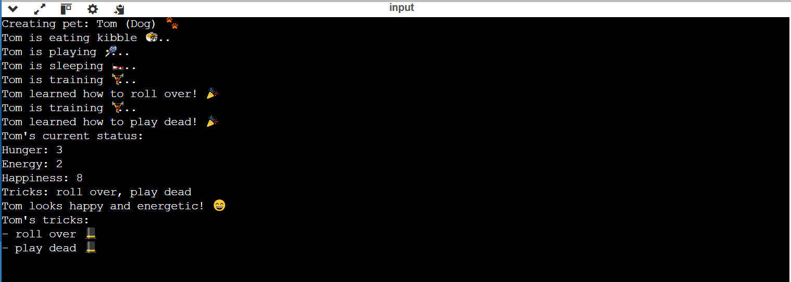

# 🐾 Digital Pet Simulator: Creative Python OOP Project

Welcome to the **Digital Pet Simulator**, an engaging Python project designed to bring your virtual pet to life using Object-Oriented Programming (OOP). 

---

## 📜 Overview

This project consists of two key files:

### 1. `pet.py`
This script defines the `Pet` class and contains the core logic for creating and managing your digital pet. The features implemented include:
- **Attributes**: `name`, `pet_type`, `hunger`, `energy`, `happiness`, and `tricks`.
- **Methods**:
  - `eat()`: Feed your pet to reduce hunger and boost happiness.
  - `sleep()`: Let your pet rest to regain energy.
  - `play()`: Play with your pet to increase happiness and hunger, while decreasing energy.
  - `bath()`: Give your pet a bath to boost happiness but slightly reduce energy.
  - `train(trick)`: Teach your pet new tricks to store in a trick list.
  - `show_tricks()`: Display all the tricks your pet has learned.
  - `get_status()`: Print your pet’s hunger, energy, happiness, and learned tricks.
- **Customizations**:
  - Added `pet_type` to differentiate between different pet kinds.
  - Included engaging messages for each action with dynamic emojis for better interaction.

### 2. `main.py`
This script demonstrates how to use the `Pet` class by:
- Creating a pet object.
- Calling its methods (`eat`, `play`, `sleep`, `train`, etc.) to test the functionality.
- Displaying the pet’s current status and learned tricks.

---

## 🎮 How to Use

1. **Clone this repository** to your local environment.
2. Open the `main.py` file and edit the pet’s name or type as desired.
3. Run the script:
   ```bash
   python main.py
   ```
4. Observe the output in your terminal as your pet eats, plays, sleeps, and learns new tricks!

---

## 💎 Features Added for Bonus Points
- **Dynamic Emojis**: Bring actions to life (e.g., sleeping 🛏️, playing 🎾).
- **Custom Actions**: Added `bath()` and `feed(food)` methods for more interaction.
- **Creative Messages**: Responses reflect the pet’s mood based on its levels.
- **Pet Types**: Differentiation of pets (e.g., Dog 🐶, Cat 🐱, Bird 🐦).

---

## ✅ Sample Output
Here’s a screenshot of the program's output:
 
